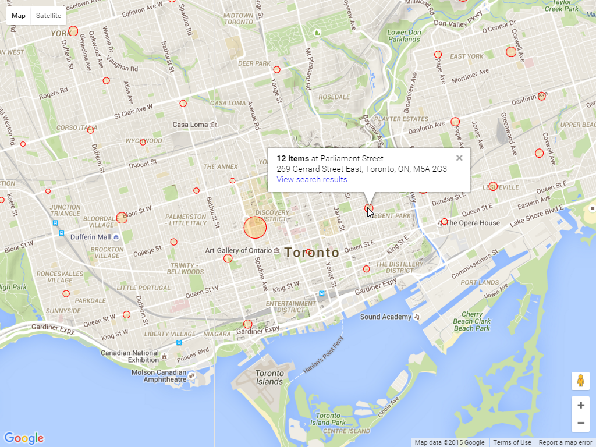

# Explore Neighbourhood Libraries

Quick prototype for the Toronto Public Library hackathon on Nov 14-15, 2015.
Sacha Chua (sacha@sachachua.com). Yay, it won!

Update 2015-11-15: This visualizes the number of search results by
branch on a map so that you can see which libraries you might want to
browse through. Right now, it requires a NodeJS server, but it should
be possible to make this entirely client-side (maybe a Chrome
extension or user script?) so that people can play with it more
easily. I'm looking forward to tinkering with this some more. Follow
this repository or get in touch for more updates!

Notes: http://sachachua.com/blog/2015/11/exploring-neighbourhood-libraries-and-other-notes-from-the-toronto-public-library-hackathon/

Released under the MIT License - have fun!

## Getting Started

### Prerequisites

- [Git](https://git-scm.com/)
- [Node.js and NPM](nodejs.org) >= v0.12.0
- [Bower](bower.io) (`npm install --global bower`)
- [Grunt](http://gruntjs.com/) (`npm install --global grunt-cli`)

### Developing

1. Run `npm install` to install server dependencies.

2. Run `grunt serve` to start the development server. It should automatically open the client in your browser when ready.

Check out `server/api/library.js` for the scraping code and `server/public/map.js` for the mapping code.

## Tampermonkey script for injection

You'll need TamperMonkey and `insert-visualize-link.js`, too.

## Released under the MIT license

Copyright (c) 2015 Sacha Chua

Permission is hereby granted, free of charge, to any person obtaining a copy
of this software and associated documentation files (the "Software"), to deal
in the Software without restriction, including without limitation the rights
to use, copy, modify, merge, publish, distribute, sublicense, and/or sell
copies of the Software, and to permit persons to whom the Software is
furnished to do so, subject to the following conditions:

The above copyright notice and this permission notice shall be included in
all copies or substantial portions of the Software.

THE SOFTWARE IS PROVIDED "AS IS", WITHOUT WARRANTY OF ANY KIND, EXPRESS OR
IMPLIED, INCLUDING BUT NOT LIMITED TO THE WARRANTIES OF MERCHANTABILITY,
FITNESS FOR A PARTICULAR PURPOSE AND NONINFRINGEMENT.  IN NO EVENT SHALL THE
AUTHORS OR COPYRIGHT HOLDERS BE LIABLE FOR ANY CLAIM, DAMAGES OR OTHER
LIABILITY, WHETHER IN AN ACTION OF CONTRACT, TORT OR OTHERWISE, ARISING FROM,
OUT OF OR IN CONNECTION WITH THE SOFTWARE OR THE USE OR OTHER DEALINGS IN
THE SOFTWARE.

